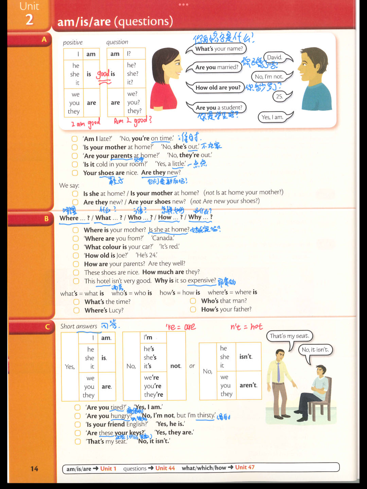
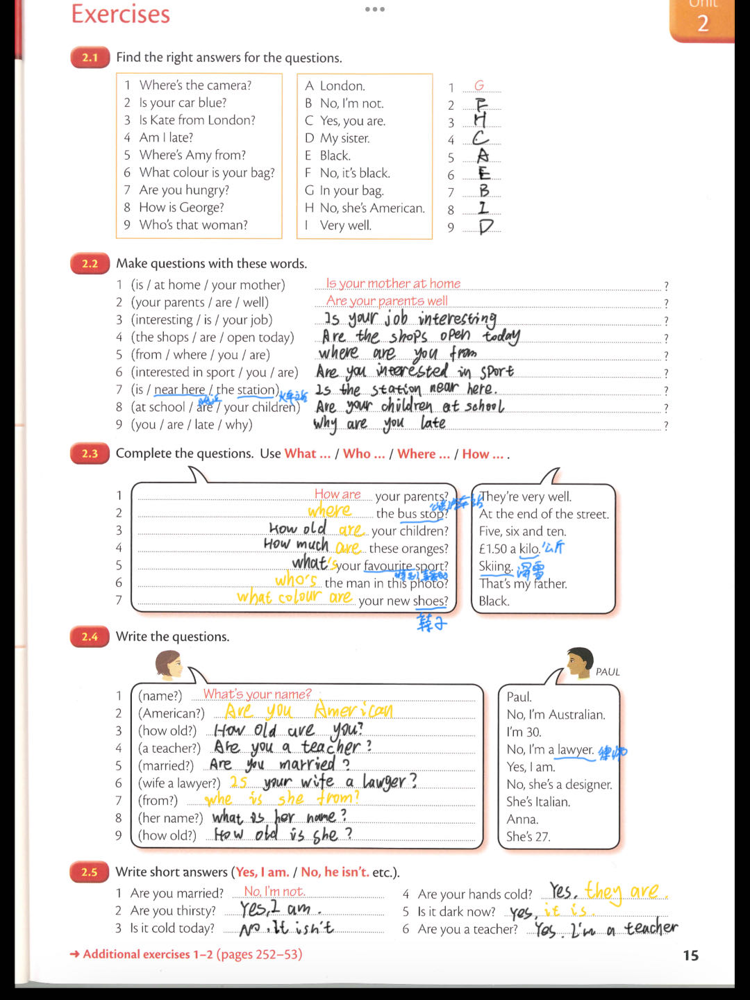

## 2023-12-14 学习日志

### 输入

#### 书籍

##### 《MySQL是怎样运行的》第6章 快速查询的秘籍 B+树索引

- 前提回顾
  - 数据页是一个双向链表，页里的数据是从小倒大顺序存储，是一个单项链表，每个数据页，都会为存储在它里面的记录生成一个页目录，在通过主键查找某条记录的时候可以在页目录中，使用二分法快速定位到对应的槽，然后再遍历该槽对应分组中的记录即可快速找到指定的记录

- 问题出现，索引引出，解决数据页查询的问题，因为是双向链表时间复杂度是O(n)
- 把所有的页进一步抽象，区分数据段
  - 一个简单的索引方案，我们也可以想办法为快速定位记录所在的数据页而建立一个别的目录，这个目录必须完成两件事
    - 给所有的页建立一个目录项，每个目录项包括下面两个部分
      - 页的用户记录中最小的主键值
      - 页号
    - 具体查找过程分两步
      - 先从目录项中根据二分法快速确定出主键值为 20 的记录在目录项 3 中
      - 在页中查找记录的方式去页 9 中定位具体的记录
- InnoDB 是多级的抽象，但一般是3层结构,InnoDB 中的索引方案
  - 记录头信息， record_type 来区别普通数据，索引，索引也是数据页
  - 一个页面至少容纳 2 条记录，解决通过树搜索了半天，页面里才一条数据的问题，避免 B+ 树的层级增长得过高（**也就是扩展树的度来抹平树的层级**）
  - 问题:那我们怎么根据主键值快速定位-个存储目录项记录的页呢?
    - 为这些存储目录项记录的页再生成一个更高级的目录，就像是-个多级目录一样，大目录里嵌套小目录，小目录里才是实际的数据（多次数据切段，更细粒度的区分，查询数据在哪个区域）
    - 下一个数据页中用户记录的主键值必须大于上一个页中用户记录的主键值
      - 在对页中的记录进行增删改操作的过程中，必须通过一些诸如记录移动的操作来始终保证这个状态一直成立：下一个数据页中用户记录的主键值必须大于上一个页中用户记录的主键值，这个过程也可以称为页分裂（Copy And Write 手法，在根节点中的可用空间用完时继续插入记录，此时会将根节点中的所有记录复制到一个新分配的页(比如页 a) 中， 然后对这个新页进行页分裂操作，得到另一个新页）
- 聚簇索引（主键索引）保存所有数据列数据，主键作为key列抽象数据分段
  - 存放目录项记录的页分为不同的层级，在同一层级中的页也是根据页 中 目录项记录的主键大小顺序排成一个双向链表
  - 所有完整的用户记录（所有列也就是数据的所有值）都存放在这个聚簇索引的叶子节点处
- 联合索引（主键+多列），假设有c2,c3列，就会先比较c2，在比较c3
- MylSAM 中的索引方案
  - 树形结构，但是却将索引和数据分开存储，单独的索引文件
  - MylSAM 会为袤的主键单独创建一个索引 ， 只不过在索引的叶子节点中存储的不是完整的用户记录，而是主键值与行号的组合·也就是先通过索引找到对应的行号 ，再通过行号去找对应的记录（二级索引）
- 总结：
  - 我们在用字典查找一个字的时候，是把数据归类（分段），按拼音，按偏旁，当数据量太大，我们继续把拼音，偏旁继续归类（分类），这就是B+ Tree
  - 回表就是查询不在索引列中的列，根据主键回查聚簇索引，这里会多一次搜索导致性能下降
  - 二级索引就是单列，联合索引就是多列，都会跟主键做索引的key
  - B+ Tree，可以通过控制树的孩子节点个数（度），来保障树的层级（高度），从而减少搜索迭代的次数，通过从小到大排列数据，我们可以利用二分搜索算法，加快查询

##### 多领国 2-3-5

##### 墨墨背单词 大学四级（6000词）

##### Essential Grammar In Use (Fourth Edition)  Unit 2

- 特殊疑问词 Where ...?（在哪里） / What ... ?（什么） / Who ... ? （谁）/ How ... ? （怎样，如何）/ Why ...（为什么），回答 Yes or No
- Are 多个对象，Is 单个对象

### 输出

暂无

