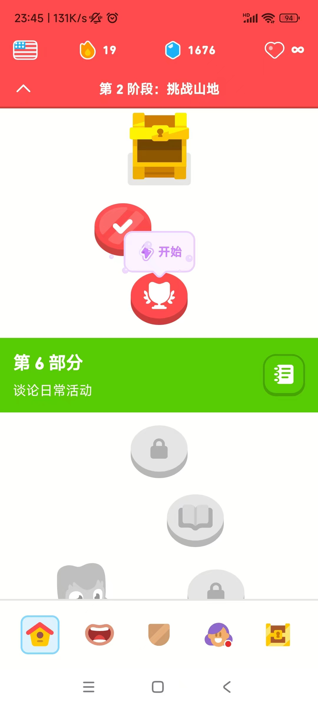
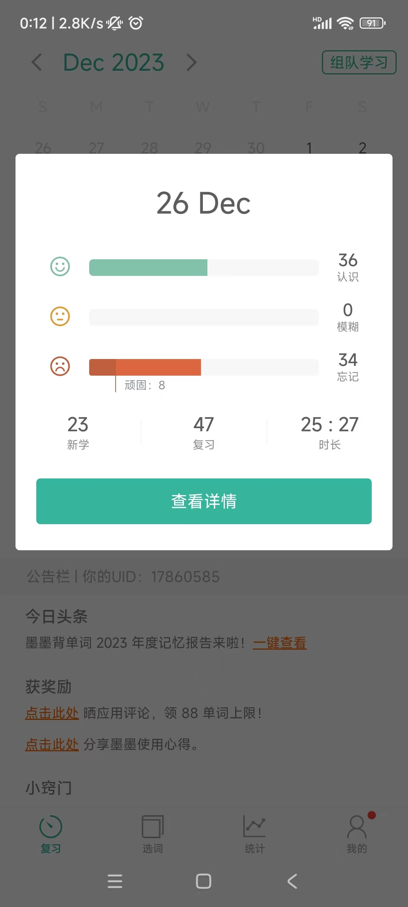
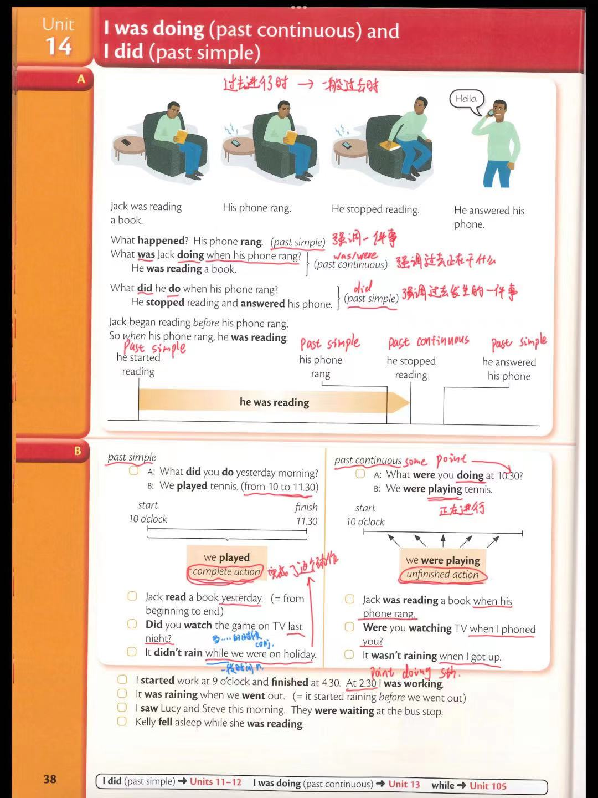
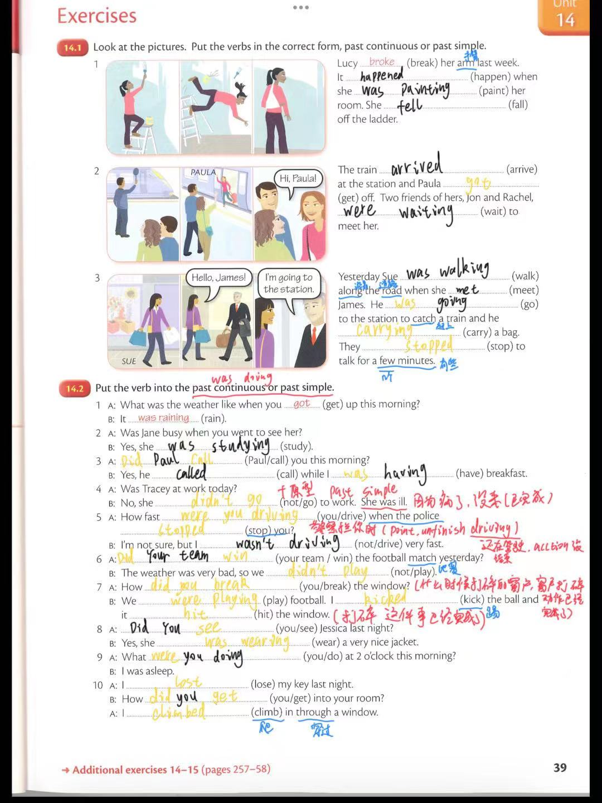

## 2023-12-26 学习日志

##### 多领国 2-5-8

##### 墨墨背单词 大学四级（6000词）

##### Essential Grammar In Use (Fourth Edition)  Unit 14

- past continous 过去进行时（强调过去正在发生的事情，未完成） and past simple 一般过去时（强调已经发生的事情，已完成）

### 输出

暂无

