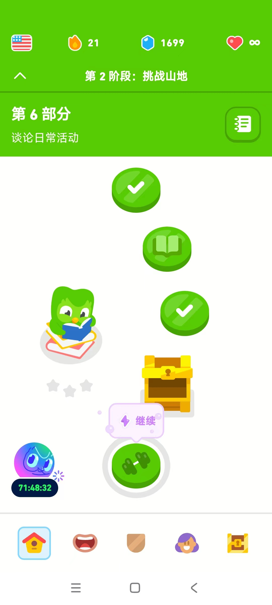
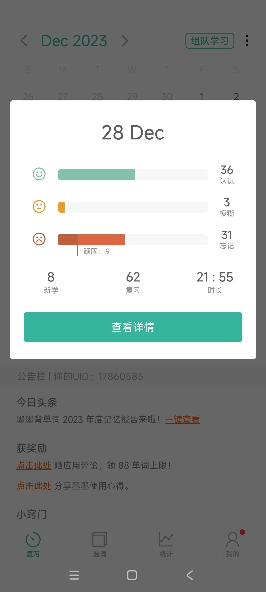
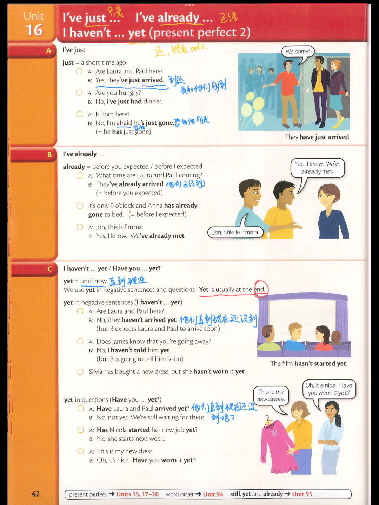
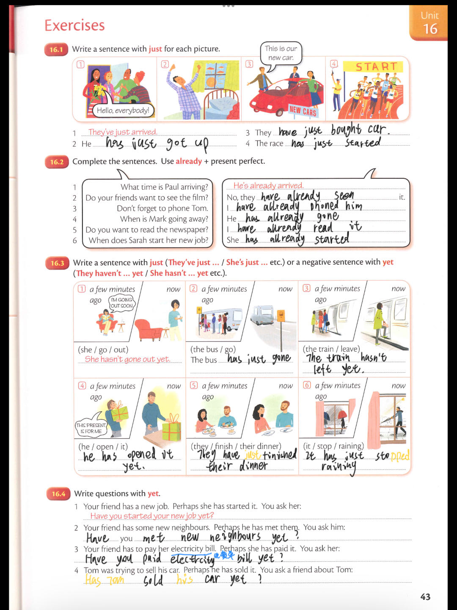

## 2023-12-28 学习日志

##### 多领国 2-6-3

##### 墨墨背单词 大学四级（6000词）

##### Essential Grammar In Use (Fourth Edition)  Unit 16

- past perfect 过去完成时，I've just（刚刚);I've already(已经)；I've...yet(直到现在);Have you ....yet(直到现在？)

### 输出

暂无

