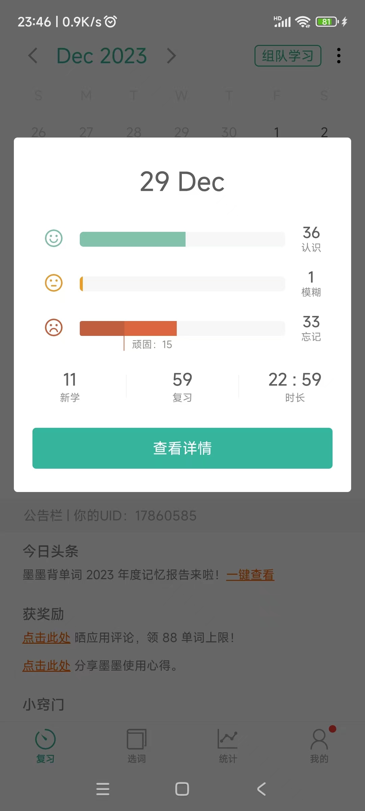
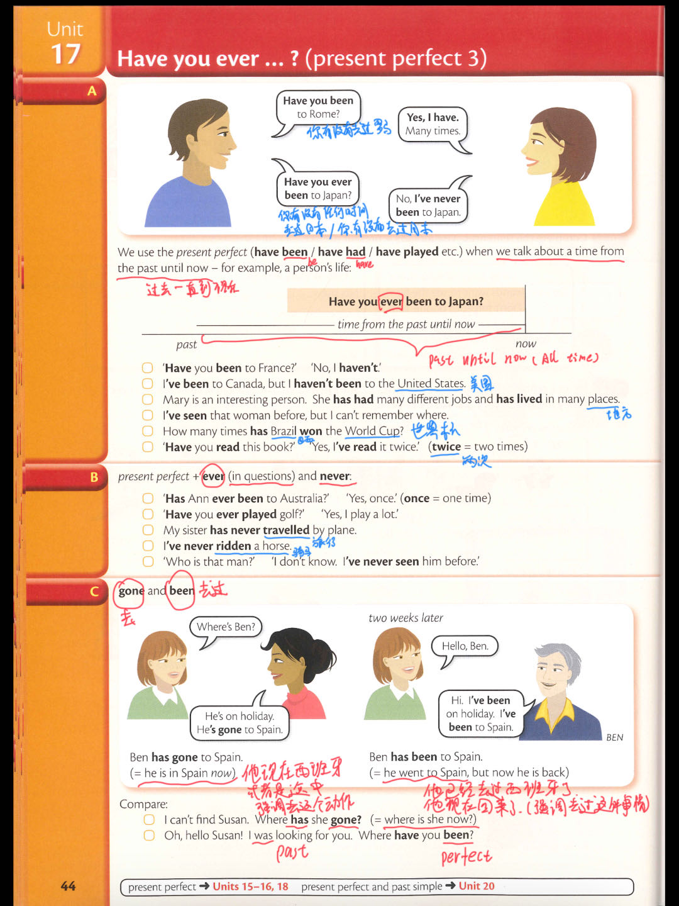
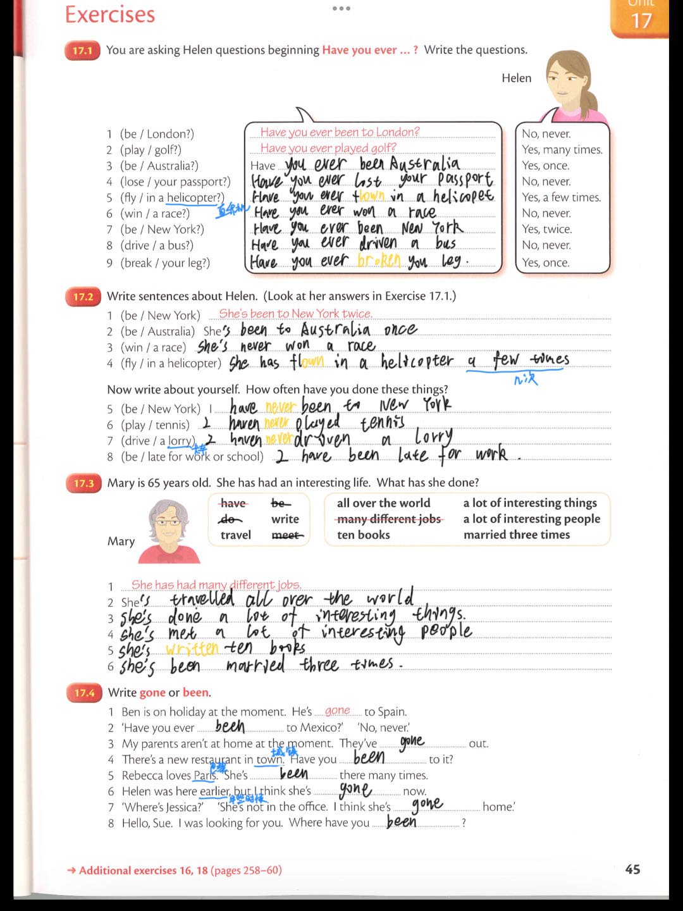

## 2023-12-29 学习日志

##### 多领国 2-6-5

##### 墨墨背单词 大学四级（6000词）

##### Essential Grammar In Use (Fourth Edition)  Unit 17

- past perfect 过去完成时，Have you ever.....(你任何.....，指过去到现在),been(强调已经去过这件事情) or gone(强调去这个动作)

### 输出

暂无

