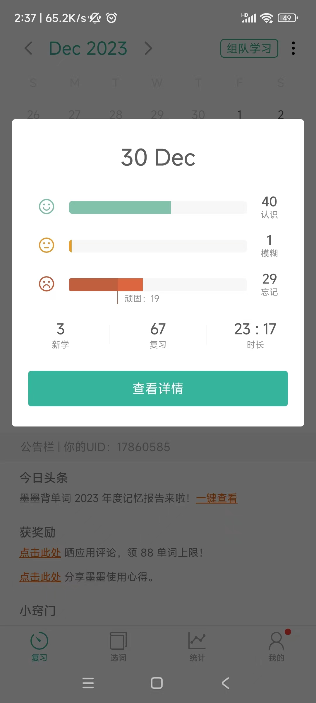
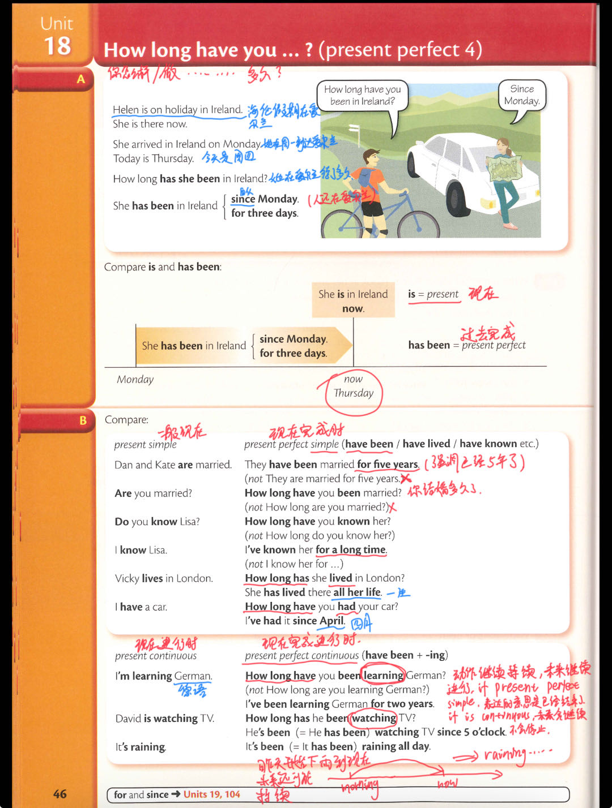
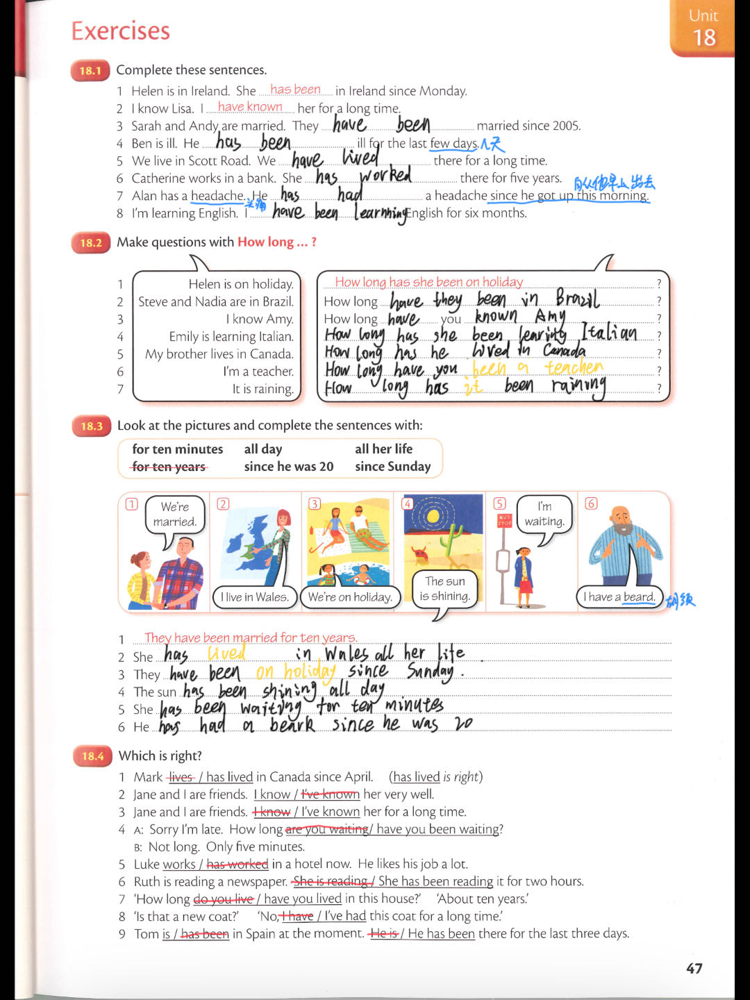

## 2023-12-30 学习日志

##### 多领国 2-6-7

##### 墨墨背单词 大学四级（6000词）

##### Essential Grammar In Use (Fourth Edition)  Unit 18

past perfect 过去完成时，How long have you(你有多久....),past perfect continuous(have been + ing)现在完成进行时

暂无

